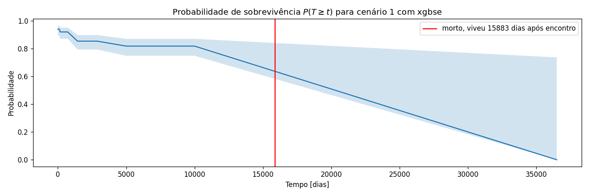
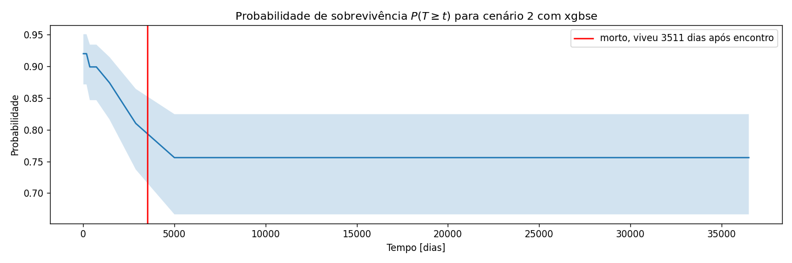
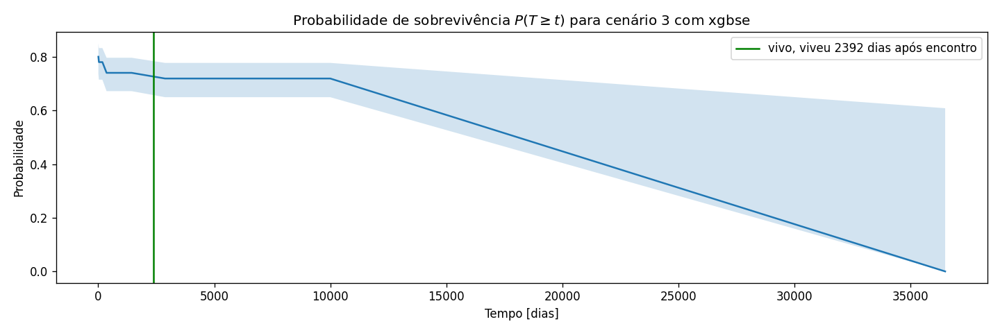

# Projeto 2 – Predizendo Prognóstico de Mortalidade com Dados Sintéticos

# Projeto `Previsão de prognóstico médico utilizando dados sintéticos`
# Project `Prognostics prediction with synthetic data`

# Apresentação

O presente projeto foi originado no contexto das atividades da disciplina de pós-graduação [*Ciência e Visualização de Dados em Saúde*](https://ds4h.org), oferecida no primeiro semestre de 2022, na Unicamp.

> |Nome  | RA | Especialização|
> |--|--|--|
> | Alan Motta Ganem  | 178777  | Computação|

# Contextualização da Proposta
> Esse trabalho busca tentar criar um modelo de previsão de prognóstico (sobrevivência) de pacientes sintéticos,
> gerados a partir do software [Synthea](https://synthea.mitre.org/). A ideia do modelo é ser genérico, a fim de que dada a descoberta de qualquer condição,
> o paciente possa conhecer suas chances de sobrevivência no tempo.
## Ferramentas
> Para tal, serão utilizadas bibliotecas de código aberto em python, como:
> - [pandas](https://pandas.pydata.org/)
> - [scikit-learn](https://scikit-learn.org/stable/)
> - [seaborn](https://seaborn.pydata.org/)
> - [xgbse](https://github.com/loft-br/xgboost-survival-embeddings)
> - [lifelines](https://lifelines.readthedocs.io/en/latest/)

> As explorações e modelagems serão realizadas em notebooks presentes na pasta `notebooks` do projeto

# Metodologia
> Para responder a pergunta inicial, iremos fazer considerar que
> cada unidade de experimento será considerada uma descoberta de condição crônica em um paciente, representada pela combinção das colunas `START` e `PATIENT`. Isso nos permite ter dados atualizados de condições
> do paciente a cada nova descoberta e atualizar assim os atributos (condições crônicas) que o representam.
> Os pacientes serão representados pelas seguintes variáveis:
> - **LAT**: float(raw) -> Latitude da posição geográfica do atendimento)
> - **LON**: float(raw) -> Longitude da posição geográfica do atendimento)
> - **AGE**: float(calculada) -> Idade do paciente)
> - **CONDITION_HISTORY**: str bag(calculada) -> Condições crônicas que o paciente tem no momento da visita
> - **CURRENT_CONDITION**: str bag(calculada) -> Condições não crônicas que o paciente tem no momento da visita
> - **RACE**: str categorical(raw) -> Raça do paciente
> - **ETHNICITY**: str categorical(raw) -> Etnia do paciente
> - **GENDER**: str categorical(raw) -> Gênero do paciente

> Como será utilizado um modelo de análise de sobrevivência, as variáveis resposta serão duas:
> - **SURVIVAL_SINCE_CONDITION**: float(calculada) -> Tempo (dias) entre a descoberta da condição e o óbito, se não houver registro de óbito, é  tempo entre a descoberta da condição e a data mais recente de registro.
> - **IS_DEAD**: bool(calculada) -> Booleano que identifica se o paciente tem registro de óbito ou não.

> Como condições válidas, consideraremos todas que não possuem o rótulo "(finding)", que indica um levantamento de dado não necessariamente relacionado á > uma condição de saúde. É interessante pontuar que algumas dessas variáveis com rótulo "(finding)" podem ser explicativas em termos de predição de > prognóstico. Por exemplo, a variável que verifica se o paciente possui um emprego estável pode ser um proxy para muitas outras variáveis, como renda, saúde
> mental, etc...
> A escolha de tirar essas variáveis do modelo tem em vista possíveis viéses que o modelo pode adquirir, e caso esse modelo seja utilizado na tomada de decisões (filas de priorização para um tratamentp, por exemplo),
> esses viéses podem retroalimentar o sistema modelado. Por exemplo, o modelo pode indicar que o fato do paciente possuir um emprego formal estável reduz sua
> chance de óbito e por isso pode despriorizar esse paciente ma fila de um transplante de orgão, por exemplo. Como essa questão envolve um debate ético mais profundo, decidiu-se
> excluir essas variáveis em um primeiro momento.

> Podemos então observar abaixo um exemplo de como os dados aparecem antes de serem transformados em variáveis dummy, para um paciente em específico:

>| PATIENT                              | START               |     LAT |      LON |     AGE | RACE   | ETHNICITY   | GENDER   | CONDITION_HISTORY                                                                                                                                                                                                        | CURRENT_CONDITION                                                        |   IS_DEAD |   SURVIVAL_SINCE_CONDITION |
>|:-------------------------------------|:--------------------|--------:|---------:|--------:|:-------|:------------|:---------|:-------------------------------------------------------------------------------------------------------------------------------------------------------------------------------------------------------------------------|:-------------------------------------------------------------------------|----------:|---------------------------:|
>| 0359aba6-a9cb-91d2-4c61-f0804f669124 | 1963-12-19 00:00:00 | 41.5569 | -70.9615 | 31      | white  | nonhispanic | M        | Sleep disorder (disorder)                                                                                                                                                                                                | Sleep disorder (disorder)                                                |         0 |                      21334 |
>| 0359aba6-a9cb-91d2-4c61-f0804f669124 | 1964-01-04 00:00:00 | 41.5569 | -70.9615 | 31.0438 | white  | nonhispanic | M        | Sleep disorder (disorder)__SEP__Sleep apnea (disorder)                                                                                                                                                                   | Sleep apnea (disorder)                                                   |         0 |                      21318 |
>| 0359aba6-a9cb-91d2-4c61-f0804f669124 | 1964-03-09 00:00:00 | 41.5569 | -70.9615 | 31.2219 | white  | nonhispanic | M        | Sleep disorder (disorder)__SEP__Sleep apnea (disorder)__SEP__Hypertension                                                                                                                                                | Hypertension                                                             |         0 |                      21253 |
>| 0359aba6-a9cb-91d2-4c61-f0804f669124 | 1970-04-13 00:00:00 | 41.5569 | -70.9615 | 37.3205 | white  | nonhispanic | M        | Sleep disorder (disorder)__SEP__Sleep apnea (disorder)__SEP__Hypertension__SEP__Coronary Heart Disease                                                                                                                   | Coronary Heart Disease                                                   |         0 |                      19027 |
>| 0359aba6-a9cb-91d2-4c61-f0804f669124 | 1994-08-10 00:00:00 | 41.5569 | -70.9615 | 61.663  | white  | nonhispanic | M        | Sleep disorder (disorder)__SEP__Sleep apnea (disorder)__SEP__Hypertension__SEP__Coronary Heart Disease__SEP__Chronic sinusitis (disorder)                                                                                | Chronic sinusitis (disorder)                                             |         0 |                      10142 |
>| 0359aba6-a9cb-91d2-4c61-f0804f669124 | 2006-11-13 00:00:00 | 41.5569 | -70.9615 | 73.9315 | white  | nonhispanic | M        | Sleep disorder (disorder)__SEP__Sleep apnea (disorder)__SEP__Hypertension__SEP__Coronary Heart Disease__SEP__Chronic sinusitis (disorder)__SEP__History of myocardial infarction (situation)__SEP__Myocardial Infarction | History of myocardial infarction (situation)__SEP__Myocardial Infarction |         0 |                       5664 |
>| 0359aba6-a9cb-91d2-4c61-f0804f669124 | 2015-06-14 00:00:00 | 41.5569 | -70.9615 | 82.5205 | white  | nonhispanic | M        | Sleep disorder (disorder)__SEP__Sleep apnea (disorder)__SEP__Hypertension__SEP__Coronary Heart Disease__SEP__Chronic sinusitis (disorder)__SEP__History of myocardial infarction (situation)__SEP__Myocardial Infarction | Viral sinusitis (disorder)                                               |         0 |                       2529 |
>| 0359aba6-a9cb-91d2-4c61-f0804f669124 | 2018-07-22 00:00:00 | 41.5569 | -70.9615 | 85.6274 | white  | nonhispanic | M        | Sleep disorder (disorder)__SEP__Sleep apnea (disorder)__SEP__Hypertension__SEP__Coronary Heart Disease__SEP__Chronic sinusitis (disorder)__SEP__History of myocardial infarction (situation)__SEP__Myocardial Infarction | Viral sinusitis (disorder)                                               |         0 |                       1395 |
>| 0359aba6-a9cb-91d2-4c61-f0804f669124 | 2021-03-09 00:00:00 | 41.5569 | -70.9615 | 88.2603 | white  | nonhispanic | M        | Sleep disorder (disorder)__SEP__Sleep apnea (disorder)__SEP__Hypertension__SEP__Coronary Heart Disease__SEP__Chronic sinusitis (disorder)__SEP__History of myocardial infarction (situation)__SEP__Myocardial Infarction | Viral sinusitis (disorder)                                               |         0 |                        434 |
>| 0359aba6-a9cb-91d2-4c61-f0804f669124 | 2022-01-05 00:00:00 | 41.5569 | -70.9615 | 89.0877 | white  | nonhispanic | M        | Sleep disorder (disorder)__SEP__Sleep apnea (disorder)__SEP__Hypertension__SEP__Coronary Heart Disease__SEP__Chronic sinusitis (disorder)__SEP__History of myocardial infarction (situation)__SEP__Myocardial Infarction | Laceration of thigh                                                      |         0 |                        132 |                                   |

> É possível observar que a coluna "CONDITION_HISTORY" possui as condições cronicas cumulativas do paciente ao longo do tempo.
> As variáveis finais que serão utilizadas pelo modelo passarão por uma etapa de seleção de features utilizando o modelo de Cox (Stel et al. 2011), considerado um modelo linear semiparamétrico para análise de sobrevivência. Devido sua formulação semiparamétrica, é possível determinar o p-valor dos parâmetros lineares de cada uma das features no modelo, de modo que é possível manter apenas as variáveis com p-valor menor que 0,05, ou levar em conta também a importância absoluta da variável  (parâmetros do modelo linear). Nesse trabalho, esse método foi utilizado para verificar inconcistências nos valores das features, verificando sua contribuição marginal para a probabilidade de sobrevivência. Assim, foi possível verificar que features que levavam em conta as condições recentes do paciente (descobertas na visita em questão) tinham um comportamento estranho (ex.: descoberta de um tumor no pulmão diminui a chance de óbito). Uma hipótese do motivo disso acontecer tem a ver com o fato de que o modelo pode estar aprendendo que a descoberta de uma condição diminui a chance de morte por ela, mas isso não explica totalmente o comportament observado e por isso esse conjunto de features foi retirado.

> Para tarefa de aprendizado, iremos considerar o framework de análise de sobreviência (Rai et al. 2021), que tenta modelar o tempo de ocorrência de um evento em um cenário de censura. A censura ocorre quando unidades do experimento ainda não registraram a ocorrência do evento em questão (óbito, por exemplo), e por isso só é possível inferir que o evento ocorrerá no futuro, mas não se sabe precisamente quando. Uma estratégia comum seria apenas considerar o histórico de pacientes que já morreram, mas isso significaria utilizar apenas 15% das bases de dados, o que prejudicaria a utilização de modelos que requerem mais dados e além disso, é possível que esse filtro leve a viéses na base de dados final.

> Como modelo principal, utilizaremos a implementação XGBSEKaplanNeighbors da biblioteca [xgbse](https://github.com/loft-br/xgboost-survival-embeddings) , que consiste em utilizar o estimador não paramétrico Kaplan-Meyer (Kishore et al. 2010) em uma vizinhaça no espaço de co-ocorrência de nós em um ensemble de árvores. Como baseline, utilizaremos o modelo de Cox.

> Para validação do modelo final, serão utilizados as métricas de índice de concordância (C-index) e Brier Score. O C-Index mede a competência do modelo em ordenar a ocorrência de eventos, similar a AUC, mas adaptado para um problema que envolve censura. Já o Brier Score mede a calibração das probabilidades geradas pelos modelos em relação a ocorrência real do evento.

> O esquema de validação serão os seguintes:
> 1. Treinar com o cenário 1 e validar com o cenário 2
> 2. Treinar com o cenário 2 e validar com o cenário 1
> 3. Treinar com o concatenado de 1 e 2 e fazer a separação em treino e teste utilizando split temporal, mantendo 20% dos dados no teste
## Bases Adotadas para o Estudo

* `patients.csv` e `conditions.csv` do `scenario01`
* `patients.csv` e `conditions.csv` do `scenario02`

# Resultados e Discussão
> 
Abaixo pode ser encontrados algumas curvas de sobrevivência para os casos 1, 2 e 3.

> Podemos observar que o método de análise de sobrevivência traz uma informação mais completa, no caso de censuras. Um alerta vermelho surge ao observamos mortes nos casos 1 e 2 quando as probabilidades de sobrevivência estão altas, isso pode significar uma calibração ruim do modelo, que será verificada com a métrica de brier.

> Abaixo temos os resultados das métricas de C-Index e Brier Score para os casos 1, 2 e 3

>|modelo|cenário|métrica|valor|
>|--|--|--|--|
>|XGBSE|1| C-index| 0.716|
>|XGBSE|1 |Avg. Brier Score| 0.536|
>|COX|1 |C-index| 0.767|
>|COX|1 |Avg. Brier Score| 0.118|
>|XGBSE|2| C-index |0.691|
>|XGBSE|2| Avg. Brier Score |1.208|
>|COX|2| C-index |0.568|
>|COX|2| Avg. Brier Score |0.456|
>|XGBSE|3| C-index |0.785|
>|XGBSE|3| Avg. Brier Score |0.029|
>|COX|3| C-index |0.836|
>|COX|3| Avg. Brier Score |0.023|

> É possível observar que para todos os casos, o modelo de Cox performou melhor em termos de C-Index, isso proavavelmente se deve ao fato de o xgbse necessitar de um volume maior de dados a fim de evitar sobreajuste.
> Outro ponto é que o cenário 3 mostrou o melhor desempenho, tanto em termos de calibração quanto em ordenação, isso provavelmente ocorre pois estamos validando o modelo em populações semelhantes com a base de treino. Nos casos 1 e 2, utilizamos populações de bases de dados (cenários) diferentes, dificultando a generalização do modelo. Ainda assim, o C-Index não foi tão baixo, o que indica que ainda que a calibração das probabilidades de morte estejam muito fora (valor de brier score alto), a ordenação sugerida pelo modelo ainda faz sentido.

# Evolução do Projeto
> Para possíveis próximos passos, pode ser interessante utilizar algum viés indutivo de profissionais da área para >construção de modelos e até mesmo para filtragem de dados, a fim de criar modelos menos genéricos, utilizando apenas >features mais apropriadas para dominios específicos, por exemplo: modelos de sobrevivencia para problemas cardíacos, >para problemas renais, etc...

# Conclusão
> É possível concluir que modelos de aprendizado de máquinas podem ser utilizados para previsão de diagnóstico, e que para volumes de dados menores, é preferível usar modelos mais simples, como por exemplo modelos lineares generalizados, como é o caso do modelo de Cox. Um possível estudo adicional a ser realizado é entender com bases de dados maiores e reais, qual seria a performance do modelo que usa ensemble de árvores (xgbse).

# Referências Bibliográficas

- Stel VS, Dekker FW, Tripepi G, Zoccali C, Jager KJ. Survival analysis II: Cox regression. Nephron Clin Pract. 2011;119(3):c255-60. doi: 10.1159/000328916. Epub 2011 Sep 14. PMID: 21921637.
- Rai, S., Mishra, P., & Ghoshal, U. C. (2021). Survival analysis: A primer for the clinician scientists. In Indian Journal of Gastroenterology (Vol. 40, Issue 5, pp. 541–549). Springer Science and Business Media LLC. https://doi.org/10.1007/s12664-021-01232
- Kishore, J., Goel, M., & Khanna, P. (2010). Understanding survival analysis: Kaplan-Meier estimate. In International Journal of Ayurveda Research (Vol. 1, Issue 4, p. 274). Medknow. https://doi.org/10.4103/0974-7788.76794
- D. Vieira, G. Gimenez, G. Marmerola, V. Estima, XGBoost Survival Embeddings: improving statistical properties of XGBoost survival analysis implementation. 2021.
